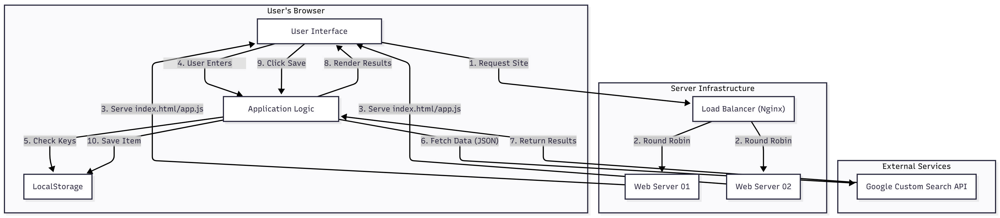
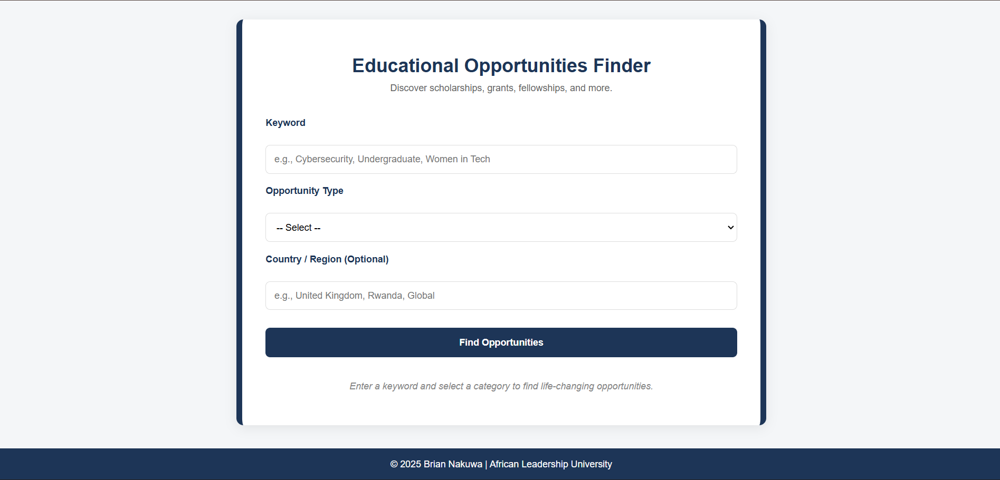

# Educational Opportunities Finder

A web application developed to help students and professionals discover scholarships, grants, fellowships, and conferences. This tool aggregates opportunities from across the web using the Google Custom Search API, providing a centralized platform for educational funding search.

## Demo Video Link
**Youtube**: https://youtu.be/NOhS6LN29OY

## App Architecture


## User Interface Design


## Features
*   **Search**: Find opportunities by keyword (e.g., "Cybersecurity").
*   **Filter**: Categorize results by Scholarships, Grants, Fellowships, or Conferences.
*   **Location Support**: Optional filtering by country or region.
*   **Direct Access**: Links directly to the opportunity pages.
*   **Favorites System**: Users can save opportunities they are interested in, and view them later on the browser's localStorage.

## Prerequisites
To run this application locally, you need:
*   A modern web browser (Chrome, Firefox, Edge).
*   A text editor (VS Code, Sublime Text, Notepad++, and more).
*   **Google Custom Search API Key** and **Search Engine ID**.

## Local Setup Instructions
1.  **Clone the Repository**
    ```bash
    git clone <your-repo-url>
    cd educational_opportunities_finder
    ```

2.  **Configure API Keys**
    There are two ways to configure your API keys:

    *   **Option A: UI Settings**
        1.  Open the application in your browser.
        2.  Click the **"Settings"** button in the top right corner.
        3.  Enter your **API Key** and **Search Engine ID (CX)**.
        4.  Click **Save**. Keys are stored securely in your browser's `localStorage`.

    *   **Option B: `config.js` File**
        1.  Create a file named `config.js` in the `scripts/` directory.
        2.  Add your keys in the following format:
            ```javascript
            const CONFIG = {
                API_KEY: 'YOUR_API_KEY',
                CX: 'YOUR_SEARCH_ENGINE_ID'
            };
            ```

3.  **Run the Application**
    *   Simply open `index.html` in your web browser.
    *   Alternatively, you can use a simple HTTP server (e.g., `python -m http.server` or VS Code Live Server) to serve the files.

## API Usage
This application uses the **Google Custom Search JSON API**.
*   **Documentation**: [Google Custom Search JSON API](https://developers.google.com/custom-search/v1/introduction)
*   **Attribution**: Search results are powered by Google.

## Deployment
The following steps outline the manual deployment process used for this application.

### 1. Packaging
Compress the project files into a single archive for easy transfer.
```bash
tar -czf educational_opportunities_finder.tar.gz index.html assets styles scripts README.md
```

### 2. Web Server Deployment (Web01 & Web02)
Repeat these steps for both Web Servers.

**Upload the Package:**
```bash
scp -i ~/.ssh/my_key educational_opportunities_finder.tar.gz ubuntu@<SERVER_IP>:/tmp/
```

**Install & Configure:**
Connect to the server and run:
```bash
ssh ubuntu@<SERVER_IP>

sudo mkdir -p /var/www/html/educational_opportunities_finder

cd /var/www/html/educational_opportunities_finder
sudo tar -xzf /tmp/educational_opportunities_finder.tar.gz

sudo chown -R www-data:www-data /var/www/html/educational_opportunities_finder
sudo chmod -R 755 /var/www/html/educational_opportunities_finder
exit
```

### 3. Load Balancer Configuration (Nginx)
Connect to the Load Balancer server (Lb01).

```bash
ssh ubuntu@<LB_IP>
sudo nano /etc/nginx/sites-available/educational-opportunities-lb
```

**Configuration Content:**
Paste the following configuration:
```nginx
upstream backend {
    server <WEB01_IP>;
    server <WEB02_IP>;
}

server {
    listen 80;
    location / {
        proxy_pass http://backend;
    }
}
```

**Enable & Restart:**
```bash
sudo ln -s /etc/nginx/sites-available/educational-opportunities-lb /etc/nginx/sites-enabled/
sudo nginx -t
sudo systemctl restart nginx
exit
```

### 4. Verification
*   Visit the Load Balancer's IP address in your browser.
*   The application should load.
*   Refreshing the page should distribute traffic between Web01 and Web02.

## Bonus: Performance Optimization
This application implements **Client-Side Caching** to improve performance and reduce API usage.
*   **Mechanism**: Search results are stored in the browser's `localStorage`.
*   **Benefit**: Repeating a search loads results instantly without a network request.

## Bonus: User Interaction (Favorites)
To enhance user engagement, a **Favorites System** has been implemented.
*   **Save**: Users can click the "Save" button on any opportunity.
*   **Persist**: Saved items are stored in `localStorage`, meaning they remain available even after closing the browser.
*   **Manage**: Users can view their saved list at the bottom of the page and remove items they are no longer interested in.

## Contact Information
*   **Name**: Brian Nakuwa
*   **Email**: [b.nakuwa@alustudent.com](b.nakuwa@alustudent.com)
*   **GitHub**: [github.com/nakuwa23](https://github.com/nakuwa23)
*   **Institution**: African Leadership University

## License
This project is for educational purposes as part of the Web Infrastructure module.


